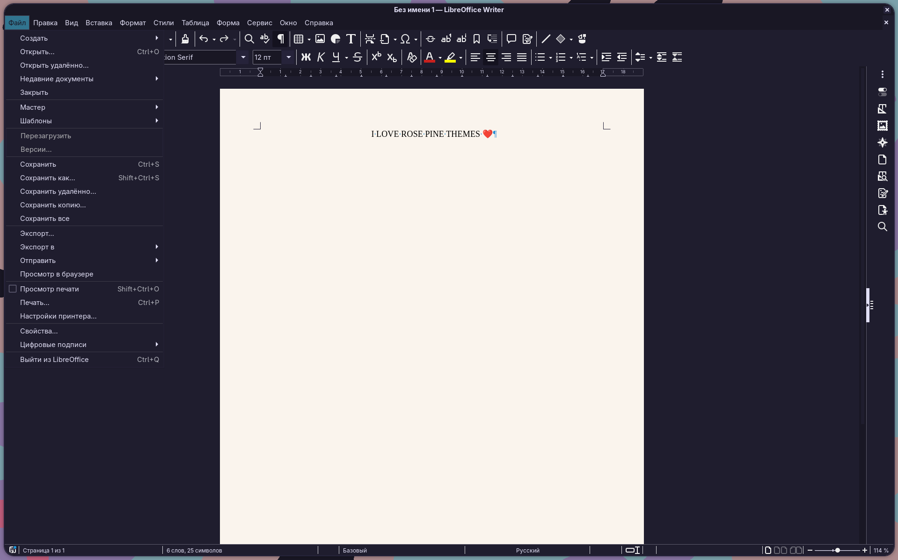
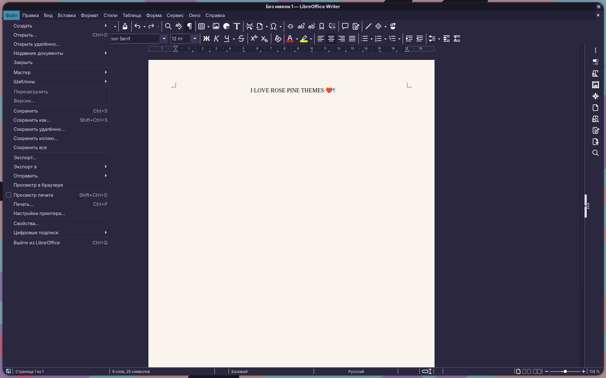
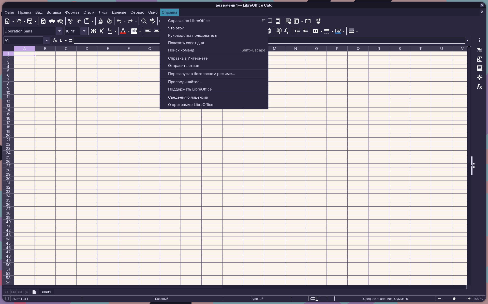
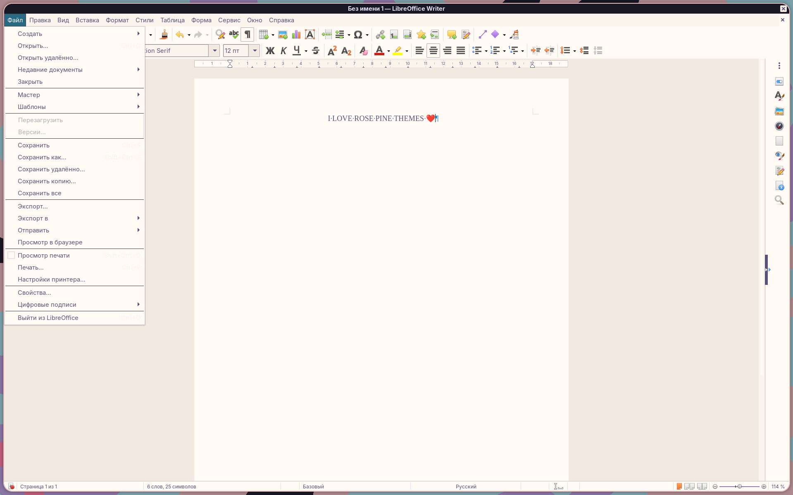
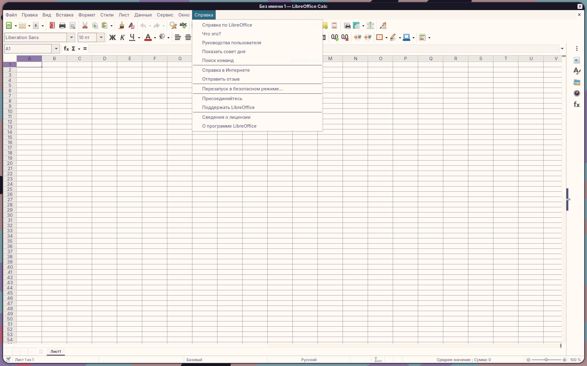

<p align="center">
    
    <h2 align="center">Rosé Pine for LibreOffice</h2>
</p>

<p align="center">All natural pine, faux fur and a bit of soho vibes for the classy minimalist</p>

## Usage

### Via LibreOffice Extension Manager (recommended)

1. Open LibreOffice
2. Go to **Tools → Extension Manager**
3. Click **Get more extensions online** — this opens extensions.libreoffice.org in your browser
4. Search for **Rosé Pine** and pick your preferred variant (Main, Moon or Dawn)
5. Click **Download** — LibreOffice will install it automatically
6. Restart LibreOffice
7. Go to **Tools → Options → LibreOffice → Application Colors** and select your variant from the Color Scheme dropdown

### Via unopkg (command line)

Download the `.oxt` file from [Releases](https://github.com/Szizoid/rose-pine-libreoffice/releases), then run:

```sh
unopkg add rose-pine-main.oxt
```

Replace `rose-pine-main.oxt` with `rose-pine-moon.oxt` or `rose-pine-dawn.oxt` for other variants. Then restart LibreOffice and select the variant under **Tools → Options → LibreOffice → Application Colors**.

### Manual install

1. Download the `.oxt` file for your preferred variant from [Releases](https://github.com/Szizoid/rose-pine-libreoffice/releases)
2. Open LibreOffice and go to **Tools → Extension Manager → Add**
3. Select the downloaded `.oxt` file
4. Restart LibreOffice
5. Go to **Tools → Options → LibreOffice → Application Colors** and select your variant from the Color Scheme dropdown

## Gallery

### Rosé Pine




### Rosé Pine Moon




### Rosé Pine Dawn




## Thanks to

- [Szizoid](https://github.com/Szizoid)

## Contributing

Clone the repo and edit the source files in `src/`:

```
src/
├── main/   ← Rosé Pine
├── moon/   ← Rosé Pine Moon
└── dawn/   ← Rosé Pine Dawn
```

Build the `.oxt` files:

```sh
bash build.sh
```

Output goes to `dist/`.
